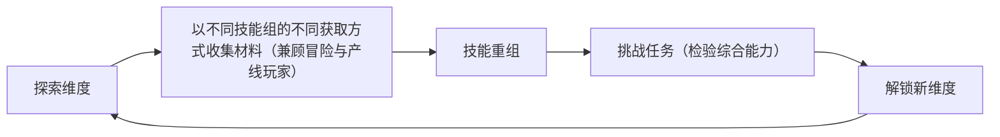

# 《穿越》策划要点解析（基于原始内容）

## 1. 项目定位

- 版本/框架：Minecraft 1.21.1（NeoForge）
- 周期：≥6个月公测；维护更新1年
- 发行：全球（避免硬编码语言，需多语言资源）
- 定位：探索为主、发展为辅；中等难度；冒险/魔法/中世纪/科技的多维度整合包
- 参考：脆骨症（以搭配组合为灵感）

## 2. 核心MOD与依赖

- 核心MOD：

  - 铁魔法
  - 末地创世（自制版）
  - 大量维度MOD
  - 机械动力
  - 自制技能MOD（核心）
- 依赖关系：

  - 自制技能MOD需联动铁魔法，将其法术自动转为自制技能
  - 末地创世承担多维度选择与起始传送

## 3. 玩法与设计目标

- 玩法定位：受绝地潜兵、其他RPG，以及整合包"放逐之路""脆骨症"的启发。希望普通玩家能丝滑体验主要流程，深度玩家可长期投入。通过设计技能系统与多元内容选择，兼顾轻度与重度玩家。
- 设计目的：难度中等。通过冒险穿越获取材料，用于获取技能组与装备；鼓励尝试机械、魔法、美食、血肉等多种流派搭配，以提升DPS并挑战可重复游玩的副本维度。
- 玩法流程（闭环思维导图）：

- 重度玩家：可进行副本挑战获取强化材料，或在家生产材料以强化技能组。
- 核心乐趣点：主动研究技能搭配以获得更高DPS与奖励，解锁更多技能；通过"技能化学反应"实现更高输出；世界难度动态变化推动搭配迭代；中期提供可重复游玩的副本丰富内容。
- 维度模块：每个维度的材料构成一种流派，玩家各阶段可自由选择解锁维度；当难度达到4或6（待定）时，解锁特殊副本维度以重复挑战完成任务。开局：获得首个末影之眼 → 末影之眼转为维度密石 → 手持密石跳入末地传送门进入所选维度；完成该维度任务并击败定制BOSS → 解锁下个维度。
- 副本模块：当世界难度达到4或6时解锁。玩家熟悉操作与搭配后，引入副本提供目标并降低跑图收集痛点；副本以太空星球为蓝本，地形较平坦，便于跑图完成任务。副本任务参考"搜打撤"：进入副本搜寻指定材料或破坏特定机器获奖；亦可快速探索星球遗迹获取更多产物。
- 装备养成系统：模块化为核心。副本系统解锁后，开启模块化装备拼装台，以材料为核心对武器进行简单改造。

  - 宝石强化系统：参考原神圣遗物。难度4或6后可在宝箱或副本获取宝石；宝石可镶嵌到武器、盔甲与升级技能上，小幅强化效果；每个宝石可升级但有失败率，以激发探索欲。

## 4. 自制技能系统（核心）

- 技能组：解锁难度随技能强度递增
- 获取/载体：通过制作并装备"技能水晶"；技能以饰品形式搭配
- 联动：自动将铁魔法的法术技能转化为自制技能
- 平衡理念：每个技能都有缺陷，促使组合互补

  - 例：高伤害→长冷却；高护甲穿透→子弹少
- 目标：驱动玩家围绕缺陷搭建"技能组"，避免单项堆数值
- 获取流程关联：采集该维度独特资源 → 制作并装备技能水晶 → 构建技能组

## 5. 动态难度系统

- 设计说明：人人独立难度，动态难度防止上手失败引发恶性循环；动态奖励激励挑战更高难度；随解锁维度提升难度符合游戏逻辑。
- 总体难度：1—10
- 动态区间：随"已解锁维度数量"提升上下限

  - 例：解锁3个维度→最低6、最高9，仅可调6—9
- 难度影响：

  - 刷怪量随难度提升而增多
  - 重甲（高护甲）单位占比提升
  - 主要压力源：非战士血量低 + 多方向刷新易被围殴
- 死亡惩罚：不严厉；复活道具廉价，降低挫败

## 6. 护甲系统（重构）

- 目的：增强装备差异化，避免"一把武器通关"，用机制强迫玩家进行技能搭配。
- 记号：p=防御点数；s=穿透点数
- 判定：

  - s ≤ 1/2 p：伤害无效
  - 1/2 p < s < p：伤害部分有效
  - p ≤ s ≤ 2p：伤害完全有效
  - 2p ≤ s：造成双倍伤害
- 投放与分类：随世界难度提升；重甲/中甲/轻甲，移速与套装效果不同
- 多人游戏：护甲系统和有限的技能搭配使游戏更适合多人游玩，玩家不用局限于全面性而能个性发展。

## 7. 怪物投放

- 设计说明：主动的怪物"拉烟"，能够让玩家不至无聊，并顺手收集经验和怪物素材。
- "拉烟"事件：地面冒烟为预兆，随后在探索中随机出现大量怪物。
- 刷新逻辑：与当前难度挂钩（数量/重甲占比上调），多方向刷新形成围攻压力；随难度上升，怪物复杂度提升以持续挑战技能搭配。

## 8. 待明确/待设计清单

- 难度区间公式与多人逻辑（初始上下限、封顶=10后的处理、多人世界进度取值）
- "伤害部分有效"的具体比例/函数；p、s的来源与成长（装备/技能/临时增益）
- 技能水晶获取与配方、饰品槽数量与限制、铁魔法→自制技能映射规则
- 维度清单、每个维度的资源/机制/任务/BOSS与掉落；密石配方与回收机制
- "拉烟"触发条件、冷却、规模、怪物池与性能限制
- 复活道具的配方、使用条件与冷却；死亡掉落与经验处理；团队复活交互
- 体力/重量系统是否启用、与移动/战斗/挖掘/护甲的联动与数值

---

文档仅对原始内容进行解析与条理化，不额外扩展设计。

